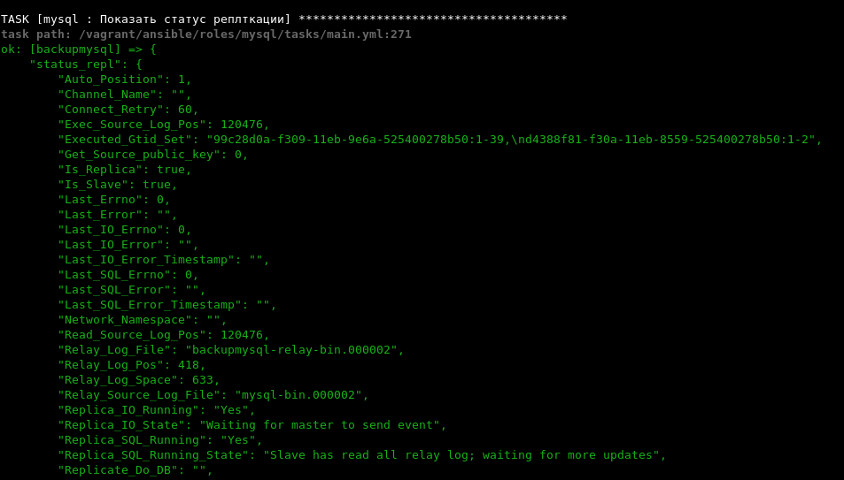
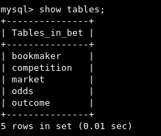
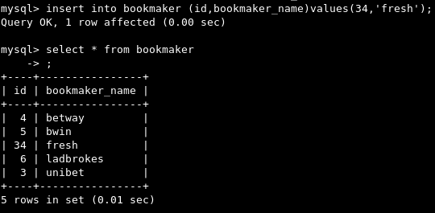
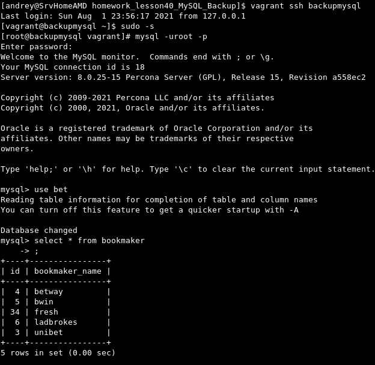

# MySQL. Backup, Репликация.

## ДЗ

Задание:

Настроить GTID репликацию
Базу bet.dmp развернуть на мастере и настроить так, чтобы реплицировались таблицы: | bookmaker | | competition | | market | | odds | | outcome. Не реплицируются таблицы:

 - bet.events_on_demand
 - bet.v_same_event

Решение:

Для решения поставленной задачи, используем MySQL v8 от компании Percona. Сервера mysql стартуем на всех доступных сетевых  интерфейсах серверов (localhost, 192.168.3.2, 192.168.3.3), для упрощения запуска Vagrantfile.

После выполнения Vagrant файла, статус репликации на Slave-e:

Таблицы в базе bet, на Slave сервере, за исключением таблиц events_on_demand и v_same_event  

___

Изменение значения (добавление строки на Master-е, в таблице bookmaker)

___

Эта строка добавляется и на Slave-e ( backupmysql)

Рабочий Vagrantfile проекта:  
[Vagrantfile](Vagrantfile)

Ссылка на ДЗ:  
[Githab link project](https://github.com/ashum1976/homework_lesson40_MySQL_Backup)

##   Общая теория, примеры, полезности.

#### Описание команд и основных опций

Просмотр текущих баз данных на сервере.
- **show databases**

___

- **CREATE USER <user_name>@'%' IDENTIFIED WITH mysql_native_password BY "secure_password"**
где:
"%" шаблонизатор означающий любой адрес в сети, кроме localhost, для него отдельное указание <user_name>@'localhost';
'IDENTIFIED WITH' - можно указать схему используемую для шифровани пароля (по умолчанию caching_sha2_password, 8 версия percona mysql), старая схема - mysql_native_password

##### Параметры настройки работы mysql

- **innodb_lru_scan_depth = 1024 - default**

Программа очистки страниц сканирует пул буферов на наличие грязных страниц, чтобы сбросить их из пула буферов на диск. Может появится предупреждение "[Note] InnoDB: page_cleaner: 1000ms intended loop took 4902ms. The settings might not be optimal"  Проблема типична для экземпляра MySQL, где высокий уровень изменений в базе данных. Предупреждение, показывает, что на нем много грязных страниц, которые нужно очистить, и для их загрузки требуется более 4 секунд.

Поставить более меньшее значение глубины поиска "грязных" страниц:

SET GLOBAL innodb_lru_scan_depth=256

___

Установка типа кодировки и представления (collation):

Если используем рекомендуемое представление, **utf8mb4_0900_ai_ci**, то значение кодировки должно быть -  **utf8mb4**
- **mysql_character_set_server: "utf8mb4"**
- **mysql_collation_server: "utf8mb4_0900_ai_ci"**

# Бэкап, репликация. Утилиты для создания

Создание зашифрованного пароля, для его использования при бэкапах базы.
- **mysql_config_editor set --login-path=local --host=localhost --user=username --password**
при использовании этого параметра, он дожен быть первым значением передаваемым mysqldump.

Пример:

_mysqldump **--login-path=local** --quote-names --add-drop-table --set-gtid-purged=OFF --single-transaction_

___

## **mysqldump**
полезные ключи:

- **--single-transaction**:
 FLUSH, фикцирование позиций, освобождение блокировки и дамп консистентной копии

- **--flush-logs**:
ротация бинари лога

- **--master-data**:
фиксирование информации SHOW MASTER STATUS

- **--events**
события планировщика

- **--routines**
хранимые процедуры и функции

- **--triggers**
триггеры

___

## **extrabackup**

- Онлайн бэкап без преывания работы БД (InnoDB)
- Инкрементальные бэкапы
- Потоковый бэкап на другой сервер
- Компрессия, шифрование
- Перемещение таблице меж серверами online
- Легкое создание новых слейвов

  **Полный бэкап:**

xtrabackup --backup --target-dir=/data/backups/base

1й Инкрементальный с момента полного:
xtrabackup --backup --target-dir=/data/backups/inc1 --incremental-basedir=/data/backups/base

2й Инкрементальный с момента 1-го:
xtrabackup --backup --target-dir=/data/backups/inc2 --incremental-basedir=/data/backups/inc1

  **Частичный бэкап:**

 - бэкап конкретных таблиц:

        xtrabackup --backup --datadir=/var/lib/mysql --target-dir=/data/backups/tables --tables="^<database name>.<table name>"

 - бэкап конкретных БД (схем):

        xtrabackup --databases='mysql sys performance_schema ...'

  ***
Восстановление данных с помощью extrabackup:**

 1. **Полное восстановление**
Перед восстановлением останавливаем mysql

- prepare - Подготовка для восстановления
- опция apply-log-only - обязательна для инкрементального восстановления
подготавливаем для восстановления базовый бэкап и оба инкремента :

      xtrabackup --prepare --apply-log-only --target-dir=/data/backups/base
      xtrabackup --prepare --apply-log-only --target-dir=/data/backups/base --incremental-dir=/data/backups/inc1
      xtrabackup --prepare --apply-log-only --target-dir=/data/backups/base --incremental-dir=/data/backups/inc2
      xtrabackup --copy-back --target-dir=/data/backups/base  <---- копирование данных в папку /var/log/mysql, из папки куда восстановили(подготовили) бэкап (--target-dir=/data/backups/base)

 2. **Частичное восстановление**

  Схема частичного восстановление (пример таблицы):

 1.
    необходим знать структуру таблиц ( dump)
      с помощью mysqldump можно снять структуру таблицы

      mysqldump -d <database name> <table name> > <filename.sql>
2.
      создаем нужную таблицу (в mysql-e создадим таблицу из файла сделанного на предыдущем шаге )

      >если восстанавливаем БД, то сначала CREATE DATABASE  

3.
    в mysql-e  выполним:

      ALTER TABLE <table name> DISCARD TABLESPACE

4.
   копируем файлы таблицы

      cp /path/to/partial/backup/* /var/lib/mysql/<database name>/

5.
    в mysql-e  выполним:

      ALTER TABLE IMPORT TABLESPACE

**подготовка для восстановления, опция --export:**

      xtrabackup --prepare --export --target-dir=/path/to/partial/backup

#### Stream  

Режим STREAM направляет поток в STDOUT в формате xbstream, а STDOUT уже можно перенаправить куда угодно

- Направляем поток в файл:

      xtrabackup --backup --stream=xbstream --target-dir=./ > backup.xbstream


   - с компрессией:   

        xtrabackup --backup --stream=xbstream --compress --target-dir=./ > backup. xbstream


  - c шифрованием   

      xtrabackup --backup --stream=xbstream | gzip - | openssl des3 -salt -k "password" > backup.xbstream.gz.des3   

  - расшифровка   

          openssl des3 -salt -k "password" -d -in backup.xbstream.gz.des3 -out backup.xbstream.gz
          gzip -d backup.xbstream.gz

- Распаковка файла xbtream:

      xbstream -x < backup.xbstream

##### Stream на другой сервер

Через ssh

      xtrabackup --backup --compress --stream=xbstream --target-dir=./ | ssh <user name>@<dest host  > "xbstream -x -C backup"

Через nc:

Слушаем на принимающей стороне:

$ nc -l 9999 | cat - > /data/backups/backup.xbstream

Отсылаем с сервера базы:

$ xtrabackup --backup --stream=xbstream --target-dir=./ | nc <dest IP> 9999
